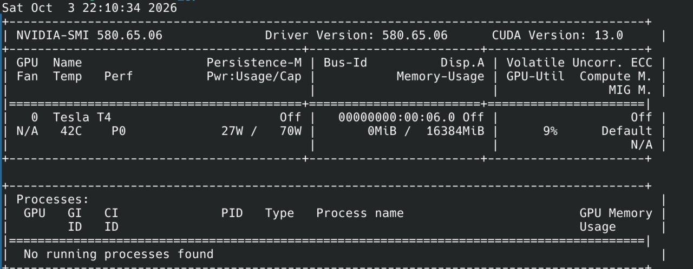
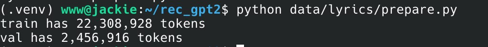
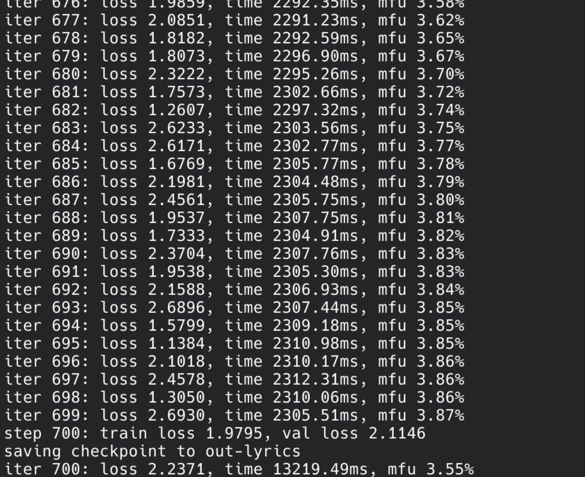
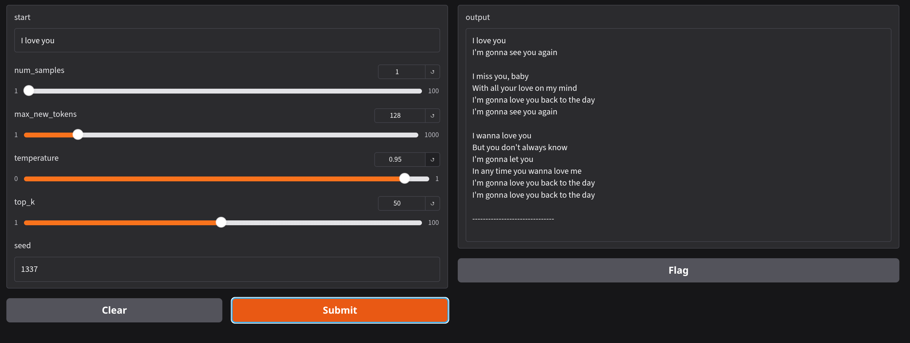

# Помощник для написания текстов песен

### Задача

Человек пишет кусок своей песни, и модель предлагает, что можно написать дальше

### Модель

я взял GPT2 и дообучил на https://www.kaggle.com/datasets/notshrirang/spotify-million-song-dataset/data

### Обучение
файл для подготовки данных лежит в /data/lyrics/prepare.py

файл для обучения лежит в /config/finetune_lyrics.py

обучалось на tesla T4 

### Визуализация
была использована библиотека gradio файл app.py
