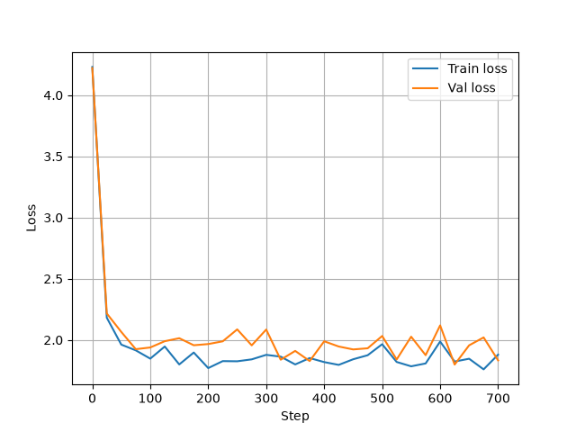

# Помощник для написания текстов песен

### Задача

Человек пишет кусок своей песни, и модель предлагает, что можно написать дальше

### Модель

за основу была взята GPT2 и она была дообучена на https://www.kaggle.com/datasets/notshrirang/spotify-million-song-dataset/data

### Датасет 

Этот датасет состоит из 57к английских песен в csv формате.

после запуска prepare.py
мы получим
```
(.venv) meow@bethanie:~/rec_gpt2$ python3 data/lyrics/prepare.py 
train has 22,308,928 tokens
val has 2,456,916 tokens
```

### Дообучение

мы получили 22'308'928 токенов

посмотрев на конфиг для дообучения в /config/finetune_lyrics.py увидим

```
batch_size = 1
gradient_accumulation_steps = 32
max_iters = 700

block_size = 1024 # в train.py

```

за 1 итерацию получим

```
>>> 1 * 32 * 1024
32768 токенов
```

тогда на 1 эквивалент эпохе в токенах уйдет

```
>>> 22308928/32768
680.814453125 итераций
```

логи с обучения доступны в logs/somelogs.txt

график



### Работа модели


для визуализации использовалась библиотека gradio 

из итогов можно заметить что модель очень любит повторять строки подряд

но увеличив температуру можно заставить ее делать более разнообразные строки


```
I love you, you and I love you  
Everyday, yes every day  
I loved you so, every day  
Each man, each woman  
  
My hand is in your heart, and my name is forevermore  
Your love, I love you for all of my life you  
Your love of life is for all of my life  
  
And love is so long to live,  
Love is so long to live  
There was a time that I'd go away and I
-------------------------------
I love you and I love you  
I love you and I love you  
I love you and I love you  
I love you and I love you  
I love you and I love you  
I love you and I love you  
I love you and will always be with you  
I want to be with you  
I want to be with you


My mother told me that you love me too.  
Your heart isn't like mine  
My mother never used to tell me
-------------------------------
I love you sweet mama jimmy  
I believe in love no matter what you think about it  
You know I try  
  
Do you think that it can't be changed  
Just change your mind with me  
Oh do you think I can change to a lie?  
Do you think i can change to a lie?  
Do you think i can change to a lie?


I can't live without you love  
You're holding me close  
So I want your
-------------------------------
I love you in all the way that I can, I love you in all the way that I can  
Oh, oh, oh


I was once upon a lonely island  
Hangin' on the rocks of the ocean  
To watch the shore drift along this coast  
I lived in the shadows, I was just a child  
Trying to learn and I was just a child  
When the day seemed like it could never last  
I was there just a single lonely island  
While there was another lonely
-------------------------------
```

пример с температурой 0.99 (все еще повторяет, но не так часто)


```
I love you, baby and I love you  
I love you, baby and I love you  
I love you, baby and I love you  
I love you, baby and I love you  
I love you, baby and I love you  
I love you, baby and I love you  
I love you, baby and I love you  
I love you, baby and I love you  
I love you, baby and I love you  
I love you, baby and I love you  
I
-------------------------------
I love you  
I love you  
I love you  
  
I love you  
I love you  
I love you  
I love you  
I love you  
  
I love you  
I love you  
I love you  
I love you  
I love you


I'm a man who's got nothing to lose  
I'm a man who's got nothing to lose  
I'm a
-------------------------------
I love you so  
I love you so  
I love you so  
I love you so  
I love you so  
I love you so  


The sun is shining  
The moon is shining  
The clouds are growing  
I'm in the air  
I'm in the air  
I'm in the air  
I'm in the air  
I'm in the air  
I'm in the air  
I'm
-------------------------------
I love you, baby  
  
[Chorus:]  
Baby, I love you, baby  
Baby, I love you, baby  
  
[Chorus:]  
Baby, I love you, baby  
Baby, I love you, baby  
  
[Chorus:]  
Baby, I love you, baby  
Baby, I love you, baby  
  
[Chorus:]


[Chorus:]  
-------------------------------
```

температура 0.68...

### Запуск

подготовка данных
```
python3 data/lyrics/prepare.py
```

дообучение

```
python3 train.py config/finetune_lyrics.py
```

запуск

```
python3 app.py
```

### Тьюториалы

https://sophiamyang.medium.com/train-your-own-language-model-with-nanogpt-83d86f26705e
https://github.com/karpathy/nanoGPT